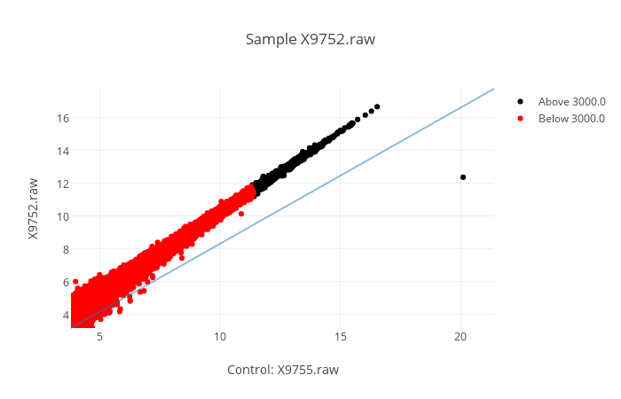
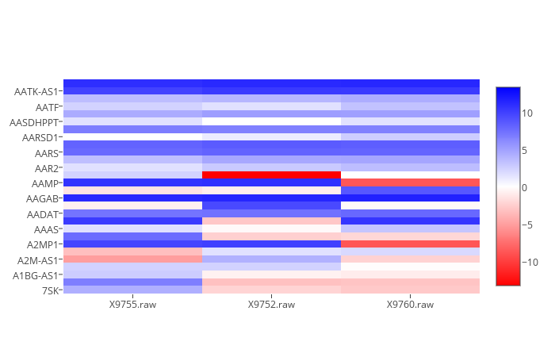
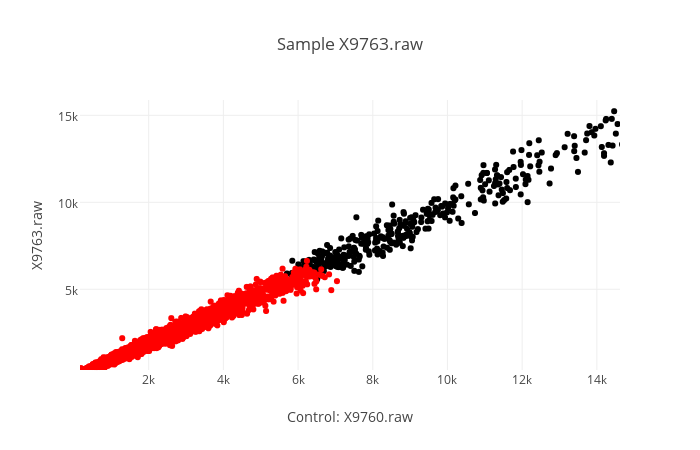
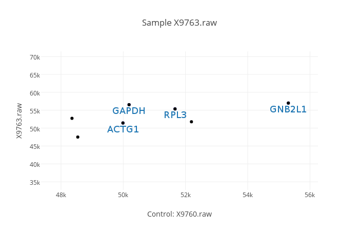

========
HelixPC
========

A series of scripts for gene database automation. Developed for the
Philippe Campeau Laboratory.

.. contents::

Installation
------------

helixPC is available on `PyPI
<https://pypi.python.org/pypi/helixpc>`_, and is easily installable
through `pip <https://pypi.python.org/pypi/pip>`_. 

For stability, it is recommended that you install this package in a
`virtual environment <https://pypi.python.org/pypi/virtualenv>`_, but
you may skip this step if you do not know how to set these up.

::

   $ pip install helixpc

That's it! You may now call the script with:

::

   $ helixpc
    
Usage
-----

``group``: Generating a file for the graphing utility
^^^^^^^^^^^^^^^^^^^^^^^^^^^^^^^^^^^^^^^^^^^^^^^^^^^^^

::
 
$ helixpc group <group_input> [--nonan] [--round [int]]

If you do not yet have a valid input file for graph generation, the
command ``group`` can help you generate one automatically. Simply stick
all your batches in a single csv file, call the utility and a file
named ``output.csv`` will be generated. You can then feed to the
graphing utility.

Please note that: 

- If certain genes are included multiple times, their
  mean will be calculated, and only a single entry will appear in 
  the output.
 
- You may pass ``[--nonan]`` or ``[-n]`` to omit any gene that
  are missing entries in a batch.

- You may round each values by passing an integer to ``[--round]`` or
  ``[-r]``. The integer passed is equivalent to the number of decimal
  places. For example, passing ``-r=2`` will round all values to the
  nearest hundredth.

- You may pass the name of the output file with ``[--output]``. If not
  used, the output file name will default to ``output.csv``

input file format
""""""""""""""""""

- Check the example ``group_input.csv``
- The first row should specify the column titles.  
- You *must* call the columns containing gene names ``gene_symbol``, 
  they are used as columns of reference by the scripts.

``graph``: Using the graphing utility
^^^^^^^^^^^^^^^^^^^^^^^^^^^^^^^^^^^^^
::

$ helixpc graph <graph_input> [--heat] [--scatter] [--alpha] [--pvalues] <control> <sample> [<sample> ...]

Used after the grouping utility. Once you have a csv file that you want 
to use for generating graph, you may feed it to the graphing utility. 
You must give the csv file a series of arguments for it to function
properly.

Arguments
"""""""""

``-s | --scatter``

Specifies that you want scatter graph(s).  Scatter graphs are
generated with a control (always the same) in the x axis, and a sample
in the y axis. Giving more than one sample will return to you multiple
graphs, one for each sample. You can hover over each point to see the
name of the gene it is representing.

``-he | --heat``

Specifies that you want a heat graph. It will graph both control and
samples. It accepts ``--no-log`` to prevent taking log_2() of all
values.

``<control>``

Specifies the control. You may give the index or the name of a
column. You may also give a series of indexes/column-names separated
by a comma, and the values used will be the mean of each row for the
series of columns given.

``<sample>``

Specifies the sample. You may give the index or the name of a
column. You may also give a series of indexes/column-names separated
by a comma, and the values used will be the mean of each row for the
series of columns given. You may specify many samples, simply put
a space in between each.

``-a | --alpha``

Specifies the alpha value. If used, you must specify an int that will
serve as the cutoff value for colorisation. See ``--pvalues``.

``-p | --pvalues``

Once you have specified an alpha value, you must specify column(s) whose
value for each gene will be compared to the alpha value. Everything
below (including) the alpha value will be colored red. Everything strictly above
the alpha will be colored black.

e.g. : ``helixpc graph output.csv -s -p=X9760.raw -a=5000 2,3 4``

``-l | --label``

Specifies the column to be used for making labels. The ten lowest and
ten highest values will be labelled on the graph.

e.g. : ``helixpc graph output.csv -s -l=X9760.raw X9753 X9763``

``-nl | --no-legend``

By default, a legend is provided on the right hand side. Since this is
not very useful for standard, unicolour graphs, you may turn this off
by passing --no-legend.

``-nlg | --no-log``

By default, the x and y coordinates will use the log_2 of the values
given. This tends to give clearer graphs, as it reduces their tendency
to elongate in a very thin shape, whilst still representing an
accurate distribution. You can turn this off by simply passing
--no-log.

``-nd | --no-diagonal``

By default, a diagonal x=x line will be drawn on the graph. You may
turn this off by passing --no-diagonal.

input file format
""""""""""""""""""

- Check the example ``graph_input.csv`` The first row should specify
  the column titles.
- The first col should contain ``gene_symbol``

``peaks``: Comparing peaks and distance by ratio
^^^^^^^^^^^^^^^^^^^^^^^^^^^^^^^^^^^^^^^^^^^^^^^^
::

$ helixpc peaks <peaks_input> [--percentage [int]]

UNDER CONSTRUCTION, currently not available

One may sometimes want to verify how closely related read peaks are,
depending on their distance and height. You can thus give a BAM file
which will be used to determine whether two peaks are closely enough
related to be categorised as the same peak.

